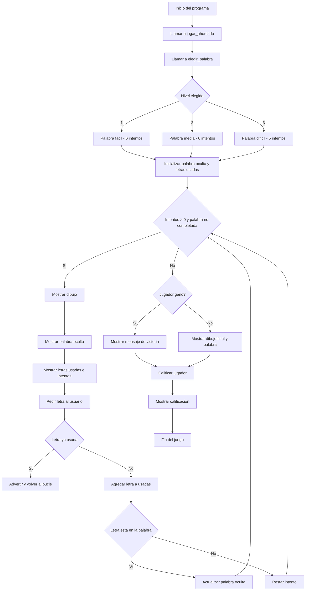

# Proyecto Final - Juego del Ahorcado (PDC)

Este proyecto consiste en una versión interactiva del clásico **juego del ahorcado**, desarrollada en Python como entrega final del curso de Programación de Computadores (PDC). El objetivo es adivinar una palabra secreta letra por letra antes de quedarse sin intentos.

## Objetivo del juego

El jugador debe evitar cometer demasiados errores mientras intenta descubrir la palabra oculta. Cada error hace avanzar el dibujo del ahorcado hasta completar todos los intentos disponibles.

---

## Estructura del proyecto

Proyecto.py ← Código principal del juego

PalabrasFacil.txt ← Lista de palabras fáciles (4-5 letras)

PalabrasMedio.txt ← Lista de palabras medias (6-7 letras)

PalabrasDificil.txt ← Lista de palabras difíciles (8+ letras)

---

## Tecnologías usadas

- Python 
- Entrada/Salida por consola
- Lectura de archivos `.txt`
- Listas, condicionales, ciclos, funciones

---

## Funcionalidades principales

- Selección de dificultad:
  - **Fácil**: palabras de 4 a 5 letras
  - **Media**: palabras de 6 a 7 letras
  - **Difícil**: palabras de 8 letras o más (con solo 5 intentos)

- Juego en consola, completamente interactivo
- Dibujo dinámico del ahorcado (ASCII) que cambia según los errores
- Validación de letras repetidas y control de errores

---

## Cómo jugar

1. Ejecuta el archivo `ProyectoPDC(1).py`.
2. Escoge una dificultad (1, 2 o 3).
3. Ingresa letras una por una e intenta adivinar la palabra antes de que se acaben los intentos.
4. Ganas si descubres la palabra completa. Pierdes si se agotan los intentos.
5. Al final del juego saldrá la calificación obtenida.

---

## Diagrama de flujo del juego



# Codigo en python #

```python
import random

# Lectura de los archivos de palabras
def cargar_palabras(nombre_archivo):
    with open(nombre_archivo, "r", encoding="utf-8") as archivo:
        lineas = archivo.readlines()
        palabras = [linea.strip().lower() for linea in lineas if linea.strip()]
    return palabras

# Archivos de palabras como listas
palabras_faciles = cargar_palabras("PalabrasFacil.txt")
palabras_medias = cargar_palabras("PalabrasMedio.txt")
palabras_dificiles = cargar_palabras("PalabrasDificil.txt")

# Dibujo del ahorcado de acuerdo al numero de intentos
dibujos = [
    """
     _______
    |/      
    |       
    |       
    |       
    |       
    |______
    """,
    """
     _______
    |/      |
    |      ( )
    |       
    |       
    |       
    |______
    """,
    """
     _______
    |/      |
    |      ( )
    |       |
    |       |
    |       
    |______
    """,
    """
     _______
    |/      |
    |      ( )
    |      /|
    |       |
    |       
    |______
    """,
    """
     _______
    |/      |
    |      ( )
    |      /|\\
    |       |
    |       
    |______
    """,
    """
     _______
    |/      |
    |      ( )
    |      /|\\
    |       |
    |      / 
    |______
    """,
    """
     _______
    |/      |
    |      ( )
    |      /|\\
    |       |
    |      / \\
    |______
    """
]

# Función para calificar al jugador
def calificar_jugador(dificultad, intentos_restantes, gano):
    if not gano:
        return "F"

    if dificultad == "1" or dificultad == "2":  # Fácil o Media (6 intentos)
        if intentos_restantes >= 5:
            return "SS"
        elif intentos_restantes >= 3:
            return "A"
        else:
            return "B"
    else:  # Difícil (5 intentos)
        if intentos_restantes >= 4:
            return "SS"
        elif intentos_restantes >= 2:
            return "A"
        else:
            return "B"

# Función eleccion de palabra y dificultad
def elegir_palabra():
    print("----------------------------------------------------")
    print("BIENVENIDO A EL JUEGO DE AHORCADO!!")
    print("Para iniciar, elige una de las siguientes dificultades")
    print("Elige dificultad:")
    print("1. Fácil  (4-5 letras)")
    print("2. Media  (6-7 letras)")
    print("3. Difícil  (8+ letras -1 intento)")
    print("----------------------------------------------------")
    
    nivel = input("Opción: ")

    if nivel == "1":
        palabra = random.choice(palabras_faciles)
        intentos = 6
    elif nivel == "2":
        palabra = random.choice(palabras_medias)
        intentos = 6
    else:
        palabra = random.choice(palabras_dificiles)
        intentos = 5

    return palabra, intentos, nivel

# Función principal del juego
def jugar_ahorcado():
    palabra, intentos, nivel = elegir_palabra()
    palabra_oculta = "_" * len(palabra)
    letras_usadas = ""

    print("\n¡Comienza el juego del ahorcado!")
    
    while intentos > 0 and "_" in palabra_oculta:
        print(dibujos[6 - intentos])
        print("Palabra: ", " ".join(palabra_oculta))
        print("Letras usadas:", letras_usadas)
        print("Intentos restantes:", intentos)
        
        letra = input("Ingresa una letra: ").lower()

        if letra in letras_usadas:
            print("Ya usaste esa letra. Intenta otra.\n")
            continue

        letras_usadas += letra + " "

        if letra in palabra:
            nueva_oculta = ""
            for i in range(len(palabra)):
                if palabra[i] == letra:
                    nueva_oculta += letra
                else:
                    nueva_oculta += palabra_oculta[i]
            palabra_oculta = nueva_oculta
            print("¡Bien! Letra correcta.\n")
        else:
            intentos -= 1
            print("Letra incorrecta.\n")

    # Fin del juego
    if "_" not in palabra_oculta:
        print("\nHas ganado! acertaste la palabra:", palabra)
        calificacion = calificar_jugador(nivel, intentos, True)
    else:
        print(dibujos[6])
        print("\nSe acabaron tus intentos, la palabra era:", palabra)
        calificacion = calificar_jugador(nivel, intentos, False)

    print("Tu calificación es:", calificacion)

# Iniciar el juego
jugar_ahorcado()
```
